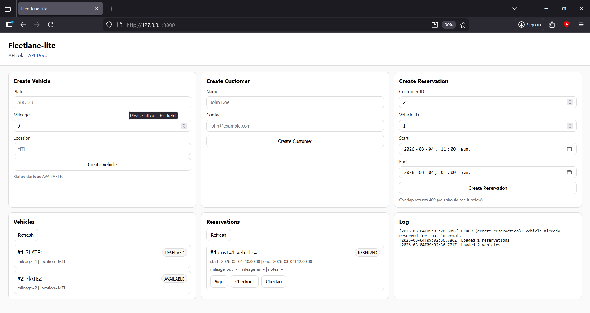
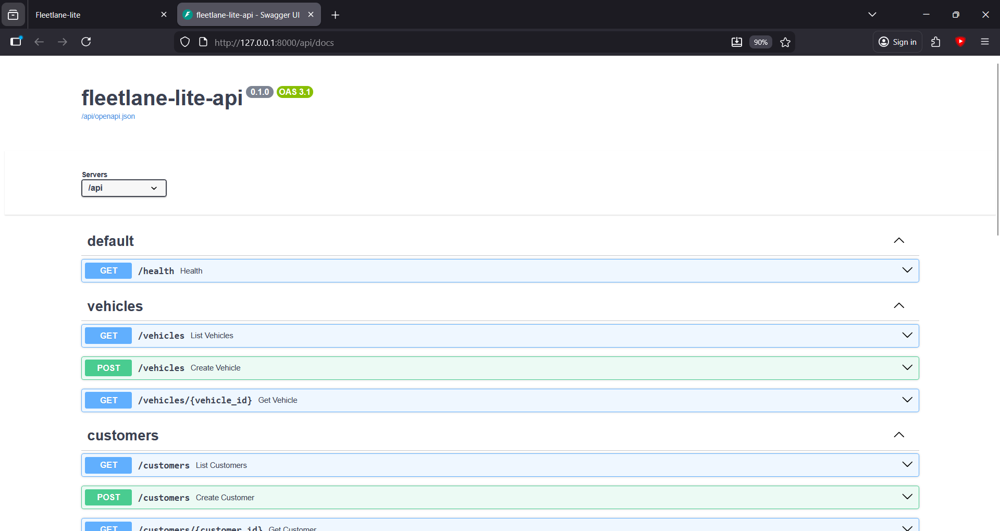

# fleetlane-lite

Minimal fleet rental workflow demo (FastAPI + SQLite + minimal JS UI).
Built to demonstrate: spec → design → implement → test → ship.

## Stack
- Backend: FastAPI, SQLAlchemy, SQLite, pytest
- Frontend: vanilla HTML/CSS/JS served by FastAPI
- OS target: Linux (works on WSL2)

## Features
- Vehicles: create, list, get by id
- Customers: create, list, get by id
- Reservations: create with overlap detection (409 on conflict), list, get by id
- Actions:
  - Sign agreement
  - Checkout (RESERVED → OUT)
  - Checkin (OUT → COMPLETED)
- Business rules:
  - Interval overlap prevention
  - State machine enforcement
  - Mileage cannot go backwards
- Tests:
  - Unit tests for overlap logic
  - API tests for 409 conflict + full lifecycle flow

## Quickstart (3 commands)
```bash
python -m venv .venv
source .venv/bin/activate
pip install -r requirements.txt

## Screenshots




