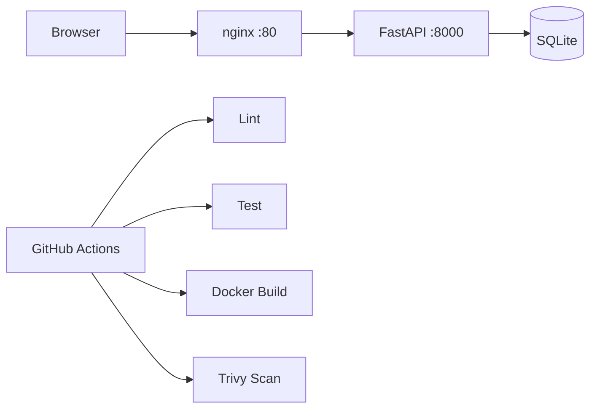
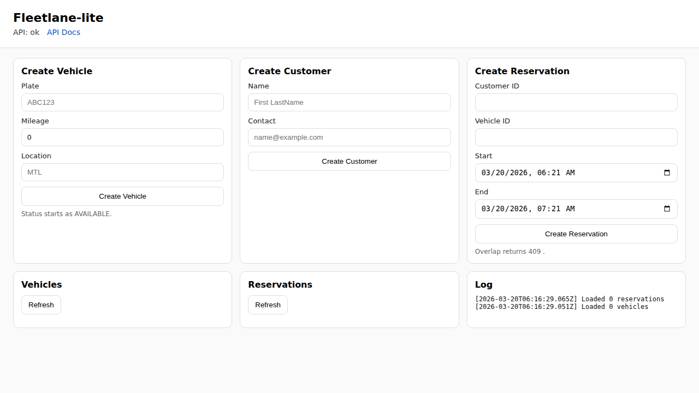
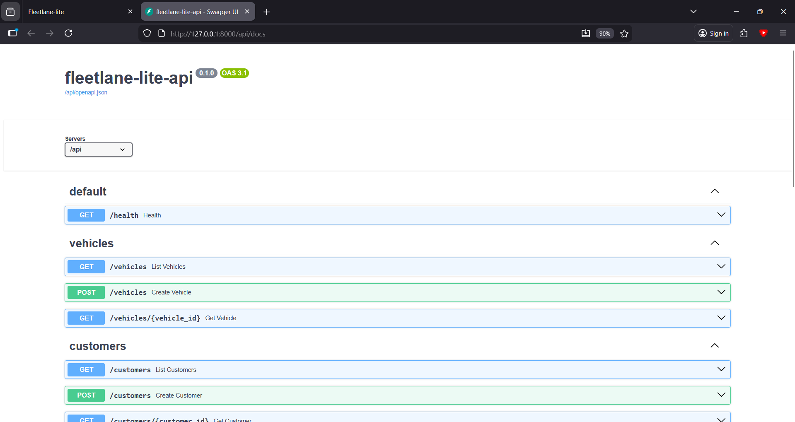

[](https://github.com/amiine-snoussi/fleetlane-lite/actions/workflows/ci.yml)

# fleetlane-lite

Minimal fleet rental workflow demo (FastAPI + SQLite + minimal JS UI).  
Built to demonstrate: spec → design → implement → test → ship.

## Stack
- Backend: FastAPI, SQLAlchemy, SQLite, pytest
- Frontend: vanilla HTML/CSS/JS served by FastAPI
- Target: Linux (works on WSL2)

## Architecture

```mermaid
graph LR
    Client[Browser] --> Nginx[nginx :80]
    Nginx --> Backend[FastAPI :8000]
    Backend --> DB[(SQLite)]
    GHA[GitHub Actions] --> Lint
    GHA --> Test
    GHA --> Build[Docker Build]
    GHA --> Scan[Trivy Scan]
```

## Infrastructure

| Component | Technology | Purpose |
|-----------|-----------|---------|
| Reverse proxy | nginx | Load balancing, SSL termination, static files |
| Application | FastAPI + Uvicorn | REST API server |
| Database | SQLite (PostgreSQL-ready) | Data persistence |
| CI/CD | GitHub Actions | Lint → Test → Build → Security scan |
| Containers | Docker + Compose | Reproducible deployments |
| Security | Trivy | Container image vulnerability scanning |

## Run with Docker
```bash
# Start everything
docker-compose up --build -d

# Access via nginx
open http://localhost

# Stop
docker-compose down
```

## What I learned building this

This project started as a FastAPI demo, then I layered production infrastructure on top:

1. **Containerization** — Multi-stage Docker build to minimize image size, non-root user for security
2. **Reverse proxy** — nginx in front of the application server, same architecture I configured for a multi-team school project
3. **CI/CD** — Automated lint, test, build, and security scanning on every push
4. **Testing** — Unit tests for business logic, API tests for the full request lifecycle
## Features
- Vehicles: create, list, get by id
- Customers: create, list, get by id
- Reservations: create with overlap detection (**409** on conflict), list, get by id
- Actions:
  - Sign agreement
  - Checkout (**RESERVED → OUT**)
  - Checkin (**OUT → COMPLETED**)
- Business rules:
  - Interval overlap prevention
  - State machine enforcement
  - Mileage cannot go backwards
- Tests:
  - Unit tests for overlap logic
  - API tests for 409 conflict + lifecycle flow

## Quickstart
```bash
python -m venv .venv
source .venv/bin/activate
pip install -r requirements.txt
cd backend
uvicorn app.main:app --reload --port 8000
````

Open:

* UI: [http://127.0.0.1:8000/](http://127.0.0.1:8000/)
* API docs (Swagger): [http://127.0.0.1:8000/api/docs](http://127.0.0.1:8000/api/docs)

## Demo script (2 minutes)

1. Create a vehicle + customer in the UI (note IDs)
2. Create reservation A (10:00–12:00)
3. Create reservation B overlapping (11:00–13:00) → expect **409 Conflict**
4. Sign → Checkout → Checkin reservation A
5. Verify vehicle status transitions + mileage updates

## Demo (60 seconds, terminal)

Start the server:

```bash
cd backend
uvicorn app.main:app --reload --port 8000
```

Run the smoke script (creates entities + triggers overlap 409 + runs actions):

```bash
./scripts/smoke.sh
```

## Dev commands (recommended)

If you have a `Makefile`:

* `make run` (start)
* `make test` (pytest)
* `make verify` (lint + tests)

Without Makefile:

```bash
cd backend && pytest -q
```

## Config

* `FLEETLANE_DATABASE_URL` (optional)

  * default: SQLite local file
  * example:

     ```bash
     export FLEETLANE_DATABASE_URL=sqlite:///./fleetlane.db
     ```

Use `.env.example` as a starting point:

```bash
cp .env.example .env
```

## API examples (request/response)

### Create a vehicle

```bash
curl -sX POST http://127.0.0.1:8000/api/vehicles \
  -H 'content-type: application/json' \
  -d '{"plate":"FL-100","mileage":12500,"location":"MTL"}'
```

Response:

```json
{
  "id": 1,
  "plate": "FL-100",
  "status": "AVAILABLE",
  "mileage": 12500,
  "location": "MTL"
}
```

### Health check (for runtime verification)

```bash
curl -s http://127.0.0.1:8000/health
```

Response:

```json
{
  "status": "ok"
}
```

## Live demo verification checklist

After `docker compose up --build -d`:

```bash
curl -s http://127.0.0.1:8000/health
curl -s http://127.0.0.1:8000/api/health
curl -s http://127.0.0.1:8000/api/docs | head -n 2
```

Expected:
- `/health` returns `{"status":"ok"}`
- `/api/health` returns `{"status":"ok"}`
- `/api/docs` returns HTML (Swagger UI)

## Repo structure

* `backend/app/` — FastAPI app, routers, models, DB
* `backend/tests/` — unit + API tests
* `frontend/` — minimal UI
* `docs/` — screenshots
* `scripts/` — demo utilities

## Screenshots






## Monitoring

FleetLane Lite includes a full observability stack with **Prometheus** and **Grafana**.

### What's Monitored

- Request rate per endpoint (req/s)
- Response time percentiles (p50, p95, p99)
- HTTP status code distribution
- Requests in progress (concurrency)

### Architecture

```
FastAPI (/metrics) → Prometheus (scrape every 15s) → Grafana (dashboards)
```

### Access

| Service    | URL                    | Credentials     |
|------------|------------------------|-----------------|
| Grafana    | http://localhost:3000  | admin / admin   |
| Prometheus | http://localhost:9090  | —               |
| API Metrics| http://localhost:8000/metrics | —        |

### Quick Start

```bash
docker compose up -d
```

Open Grafana at `localhost:3000` — the **FleetLane Lite — API Monitoring** dashboard is pre-provisioned and ready.
